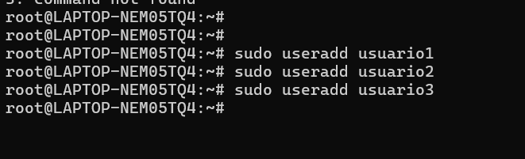
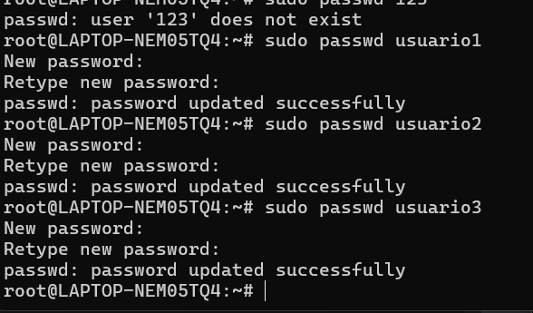
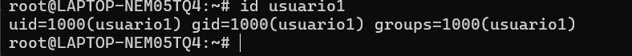
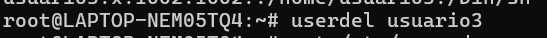
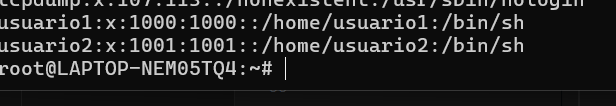
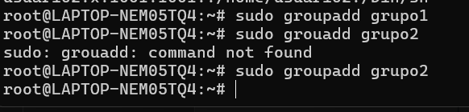
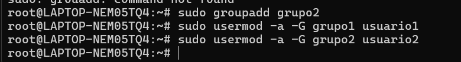
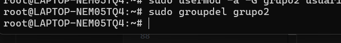

### Universidad de San Carlos de Guatemala
### Facultad de Ingeniería
### Sistemas Operativos 1

#### Kelly Mischel Herrera Espino
#### 201900716

## Comandos

### Creaciòn de usuarios:

#### Usuario 1

    sudo useradd usuario1

#### Usuario 2

    sudo useradd usuario2
#### Usuario 3

    sudo useradd usuario3

### Asignaciòn de contrasenas

    sudo passwd usuario1
    1234

    
    sudo passwd usuario2
    123
    
    sudo passwd usuario3
    123

### Informaciòn de Usuario
 
#### Usuario 1
    id usuario1

### Eliminación de Usuario
 
#### Usuario 3
    userdel usuario3
    

#### Comnando para verificar que ya no esta el usuario

    cat /etc/passwd

### Creaciòn de grupos:

#### Grupo1

    sudo groupadd grupo1

    sudo groupadd grupo2

### Agregar Usuarios a los grupos

#### Uusario1 al grupo1

    sudo usermod -a -G grupo1 usuario1

#### Uusario2 al grupo2

    sudo groupadd grupo2

### Verificar Membresìa
    groups usuario1
    groups usuario2
### Eliminar grupo2
    sudo groupdel grupo2

### Gestionar Permisos

Inicio de sesiòn con el usuario:

    su -usuario1

### Creaciòn del archivo

    echo "Hola mundo, archivo1" > ~/archivo1.txt

Direcctorio y archivo:

    mkdir ~/directorio1

    echo "Hola mundo2" > ~/directorio1/archivo1.txt

###  ¿Por qué es importante gestionar correctamente los usuarios y permisos en un sistema operativo?

Es importante debido a que de esta forma se puede mantener la seguirda y privacidad de los datos en uns SO.
